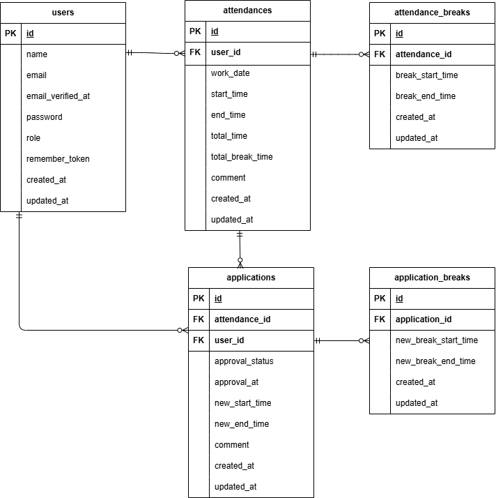

# coachtech 勤怠管理アプリ

## 環境構築

### Docker ビルド

1. git clone git@github.com:mami-kbb/time-card.git
2. docker-compose up -d --build

&nbsp;&nbsp;&nbsp;&nbsp;&nbsp;※ OS 環境によって MySQL コンテナが起動しない場合があります。その場合は docker-compose.yml を各自の環境に合わせて調整してください。

### Laravel 環境構築

1. docker-compose exec php bash
2. composer install
3. cp .env.example .env
4. .env ファイルの一部を以下のように編集

```
DB_HOST=mysql
DB_DATABASE=laravel_db
DB_USERNAME=laravel_user
DB_PASSWORD=laravel_pass
```

5. php artisan key:generate
6. php artisan migrate
7. php artisan db:seed

## Mail 設定（開発環境）

メール認証機能を利用するため、`.env` に以下を設定してください。

```
MAIL_MAILER=smtp
MAIL_HOST=mailhog
MAIL_PORT=1025
MAIL_FROM_ADDRESS=test@example.com
```
※ MailHog を使用しています。


## テスト環境構築

1. cp .env.example .env.testing
2. .env.testing ファイルの一部を以下のように編集

&nbsp;&nbsp;&nbsp;&nbsp;&nbsp;※ demo_test は事前に MySQL 上で空のデータベースを作成してください
（`CREATE DATABASE demo_test;` で作成できます）

```
APP_ENV=test
DB_CONNECTION=mysql_test
DB_HOST=mysql
DB_DATABASE=demo_test
DB_USERNAME=root
DB_PASSWORD=root
```

3. php artisan key:generate --env=testing
4. php artisan migrate --env=testing
5. php artisan test

## user のログイン用初期データ

- メールアドレス: hoge@example.com
- パスワード: hoge1234

## 使用技術

- MySQL 8.0.26
- PHP 8.1-fpm
- Laravel 8
- mailhog

## 開発環境

- ログイン画面: http://localhost/login
- 会員登録画面: http://localhost/register
- phpMyAdmin: http://localhost:8080/
- mailhog: http://localhost:8025

## ER 図


## 追記事項

-勤怠一覧画面の表示月に月ピッカーを設定して表示したい月を選択できる仕様になっています。