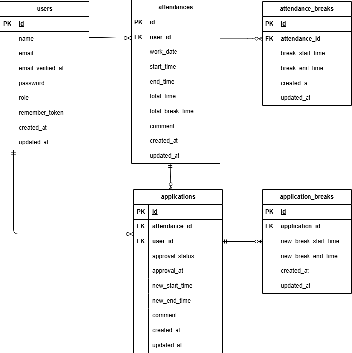

# coachtech 勤怠管理アプリ

## アプリ概要

勤怠の打刻・修正申請・管理者承認を行う勤怠管理アプリです。

主な機能

【ユーザー機能】
- 出勤 / 退勤 打刻
- 休憩管理
- 勤怠修正申請
- 月次勤怠一覧

【管理者機能】
- 勤怠修正
- 修正申請承認
- CSVエクスポート

## 環境構築

### Docker ビルド

1. git clone git@github.com:mami-kbb/time-card.git
2. docker-compose up -d --build

&nbsp;&nbsp;&nbsp;&nbsp;&nbsp;※ OS 環境によって MySQL コンテナが起動しない場合があります。その場合は docker-compose.yml を各自の環境に合わせて調整してください。

### Laravel 環境構築

1. docker-compose exec php bash
2. composer install
3. cp .env.example .env
4. .env ファイルの一部を以下のように編集

```
DB_HOST=mysql
DB_DATABASE=laravel_db
DB_USERNAME=laravel_user
DB_PASSWORD=laravel_pass
```

5. php artisan key:generate
6. php artisan migrate
7. php artisan db:seed
8. chmod -R 777 storage
9. chmod -R 777 bootstrap/cache

※ storage と bootstrap/cache は Laravel がログやキャッシュを書き込むために
書き込み権限が必要です。

## Mail 設定（開発環境）

メール認証機能を利用するため、`.env` に以下を設定してください。

```
MAIL_MAILER=smtp
MAIL_HOST=mailhog
MAIL_PORT=1025
MAIL_FROM_ADDRESS=test@example.com
```
※ MailHog を使用しています。


## テスト環境構築

1. cp .env.example .env.testing
2. .env.testing ファイルの一部を以下のように編集

&nbsp;&nbsp;&nbsp;&nbsp;&nbsp;※ demo_test は事前に MySQL 上で空のデータベースを作成してください
（`CREATE DATABASE demo_test;` で作成できます）

```
APP_ENV=test
DB_CONNECTION=mysql_test
DB_HOST=mysql
DB_DATABASE=demo_test
DB_USERNAME=root
DB_PASSWORD=root
```

3. php artisan key:generate --env=testing
4. php artisan migrate --env=testing
5. php artisan test

## ログイン用初期データ

### 管理者ユーザー
メールアドレス  
admin@example.com

### 一般ユーザー
- reina.n@example.com
- taro.y@example.com
- issei.m@example.com
- keikichi.y@example.com
- tomomi.a@example.com
- norio.n@example.com

※パスワードはすべて共通です  
password: test1234


## 使用技術

- Laravel 8
- PHP 8.1-fpm
- MySQL 8.0.26
- Docker
- Nginx
- MailHog

## 開発環境

- ログイン画面: http://localhost/login
- 会員登録画面: http://localhost/register
- phpMyAdmin: http://localhost:8080/
- mailhog: http://localhost:8025

## ER 図


## 追記事項

- 勤怠詳細画面のルーティングについて

開発当初は勤怠詳細画面を以下のように **attendance の id を基準としたルート**で実装していました。

```
/attendance/detail/{id}
/admin/attendance/{id}
```

しかし、勤怠は **日付単位で管理されるデータ**であるため、
URLから対象日が分かる設計の方が適切と考え、最終的に以下のような **日付ベースのルーティング**へ変更しました。

```
/attendance/detail/{date}
/admin/attendance/{user}/{date}
```

この変更により、

- 勤怠データが未作成の日でも詳細画面を表示できる
- URLから対象日を直感的に把握できる
- 管理者画面では「ユーザー × 日付」で勤怠を特定できる

というメリットがあります。

- 勤怠一覧画面の表示月に月ピッカーを設定して表示したい月を選択できる仕様になっています。
- 要件シートの基本設計書内にあるRegisterRequest.phpの内容につきましては、Fortifyの仕様に従い`App\Actions\Fortify\CreateNewUser` クラス内に実装しています。
- メール認証機能を導入しました。
- サンプルデータは 11 月～ 2 月分の勤怠データが作成される仕様になっています。
- 管理者が勤怠詳細画面から勤怠の修正を行った際、修正ボタン押下後、「※修正しました」というメッセージを修正ボタンの左に表示されるようにしました。
- テストケース一覧にある画面表示に関するテストでは、画面表示の検証だけでなく、データベースへの保存が正しく行われていることも確認しています。  
  画面上は正常に表示されていても、保存処理が失敗している可能性があるため、DBの状態も併せて検証しています。
- テストケース一覧にあるテスト内容の「出勤時間が退勤時間より後になっている場合、エラーメッセージが表示される」についてですが、機能要件に基づいてエラーメッセージは「出勤時間もしくは退勤時間が不適切な時間です」でテストを行っています。